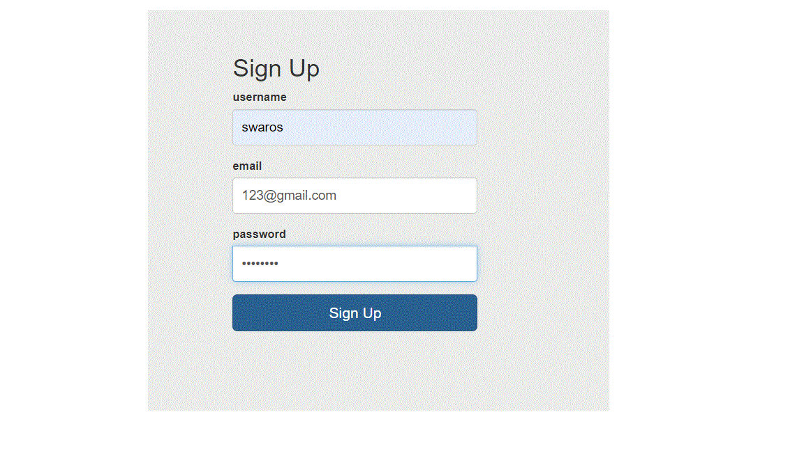
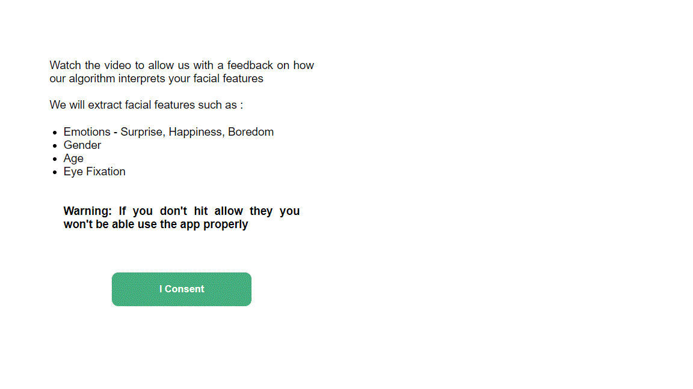
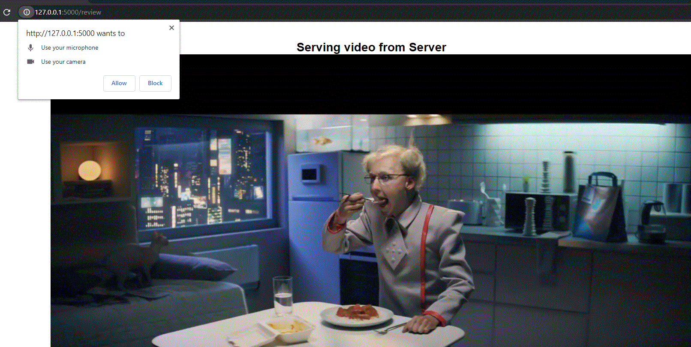
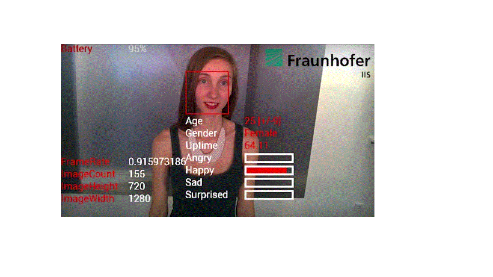
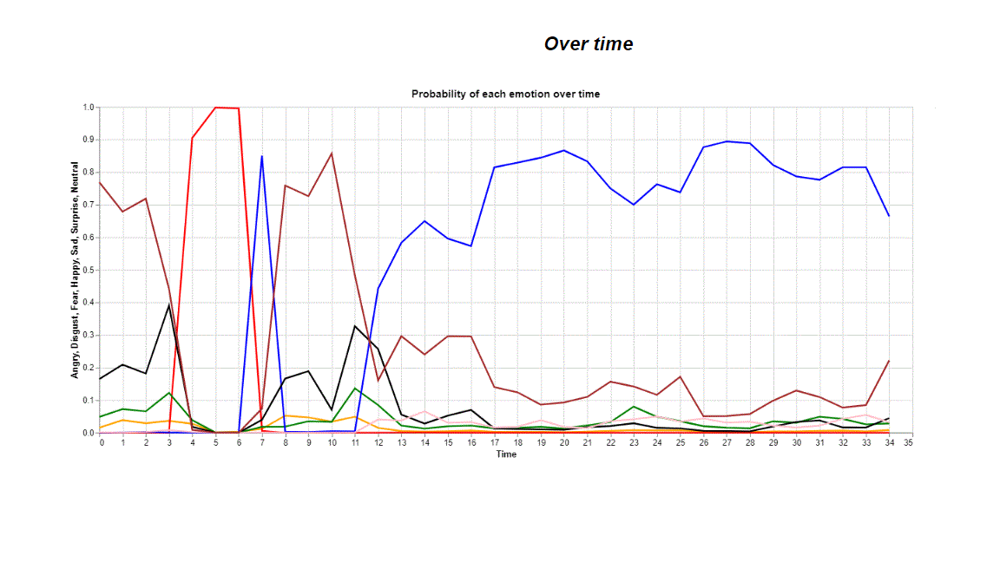
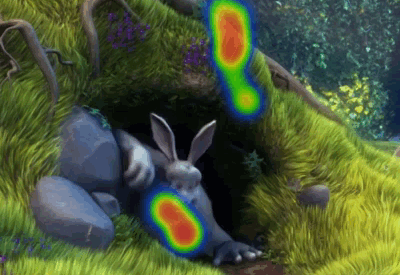

# Multi-Modal Facial Detection
This project enables the client serving the video to record users' facial features while they are watching a video, movie trailer, advertisement, or product launch. The webcam starts simultaneously when the video on the browser loads using WebRTC. The data collected from the webcam is passed to a Python file that detects emotions, tracks eye gaze, and predicts the age and gender of the person watching the video using Fer2013 data.

The goal of this project is to have a browser extension, mobile app, and web app that connect to Adtech platforms. When a user logs into the app, they are asked to give consent by pressing the "I consent" button. They are then directed to a page that serves a video advertisement. Once the video starts, the webcam opens and asks for access on the user's browser. When the video stops, the webcam recording also stops, and the recorded blob is stored as a video file in the "uploads_files" folder or S3 bucket. This data allows advertising companies and publishers to understand the user's focus and engagement level with the ad.

Use app1.py to run instead of main.py.

app1.py fires the Flask server. After a new user logs into the App, they would be asked to give consent by pressing "I consent" button. They would then be directed to a page that serves a video advertisement. Once the video advertisement starts, a webcam would open, again asking for access on their browser. Once the vid stops, recording of the webcam would also stop. The recorded blob would be stored as a video file on "uploads_files" folder or S3 bucket. 

At the backend, 
1) the advert video file gets converted to frames using video2frames.py - the output can be stored in output_frames;
2) Heatmap_on_Frames.py adds heatmap on the frames using the data from eye_gaze_analysis.py file;
3) frame_to_video.py converts the video with heatmap back to a video;
4) all the above sequence of functions are performed using flame_thrower.py

Feature extractions:
1) The cam gets converted into a video blob in app1.py and gets uploaded to a folder "upload_files". This can also be a S3 bucket;
2) The cam from the upload_files folder is pulled by VideoProducer.py;
3) VideoProducer sends this data to consumer_Expression.py and consumer_eyeGaze.py;
4) These in turn send the data to face_expressions.py and eye_gaze_analysis.py respectively;
5) The output from face_expressions will be a csv file;
6) The output from eye_gaze_analysis will be a txt file, which will be sent to fixpos2Densemap above. 

Note: Here I have hard coded the VideoProducer to take video.mp4 and video1.mp4 for expressions and eye_gaze_analysis

watcher.py folder is an Event Handler. It is currently set to the "output" folder. Any change in that folder will trigger a response from this file. One can set this to S3 bucket or refer to this :
https://github.com/gwenshap/lambda_s3_kafka/blob/master/lambda_s3_kafka.py

Use Python 3.6.5 

Steps to the App:
1) Sign up  to the App:

2) When you login for the first time, give consent:
   

3) Allow access to the webcam on your laptop, desktop through your browser:
   
   

By giving access to the webcam, the users are allowing us to capture their facial expressions and make a guesstimate for:
Expressions, Age, Gender and also track their eyes as they watch the video. 

The data we share with clients serving the video:

Example:: Emotions of users watching a video over time 

Eye Gaze of what the users were engaging their eyes on per frame

